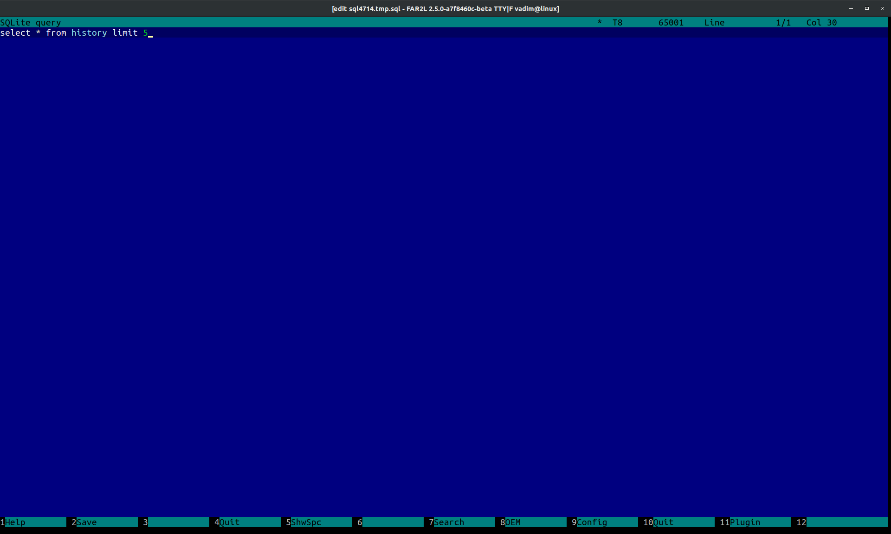

# sqlplugin

Плагин позволяет (linux и macos):
 * просматривать, редактировать информацию sqlite файла, ...

Основан на плагине SQLiteDB plug-in for FAR 3.0 Copyright (C) 2010-2014 by Artem Senichev
Использует sqlite3 engine https://www.sqlite.org/

The plugin allows (linux and macos):
  * view and edit information sqlite file, ...

Based on SQLiteDB plug-in for FAR 3.0 Copyright (C) 2010-2014 by Artem Senichev
Use sqlite3 engine https://www.sqlite.org/

Build instruction like far2l (https://github.com/VPROFi/far2l)

If your want build inside other version far2l - put content ./src into ./far2l/sqlplugin and add to ./far2l/CMakeLists.txt add_subdirectory (sqlplugin)

